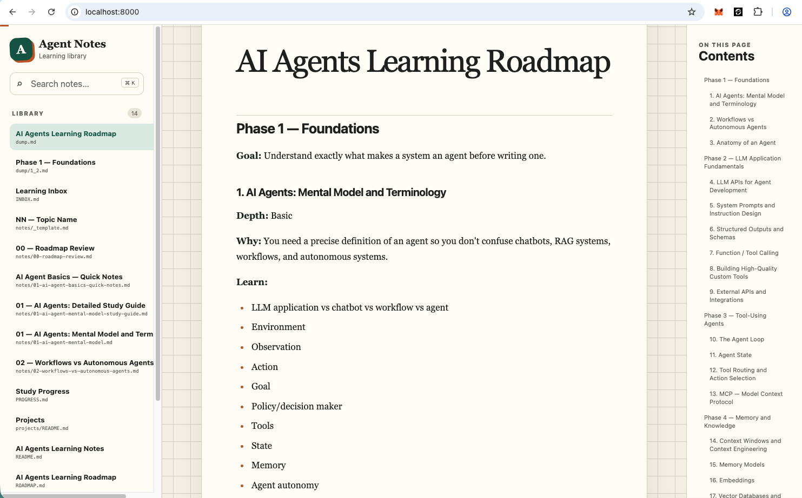

# AI Agents Learning Roadmap

A structured, hands-on roadmap for learning AI agents from first principles to production-ready systems through notes, exercises, projects, and practical experimentation.

## View the notes locally

From the project directory, start a local server:

```bash
python3 -m http.server 8000 --bind 127.0.0.1
```

Then open [http://localhost:8000](http://localhost:8000) in your browser. Press `Ctrl+C` in the terminal to stop the server.

> On Windows, use `py -m http.server 8000 --bind 127.0.0.1` if `python3` is unavailable.



## Guiding principle

> First learn to build the agent loop yourself. Then learn architectures. Then frameworks. Then reliability and production engineering.

Core mental model:

```text
Agent = Model + Instructions + State + Tools + Control Loop
      + Environment + Memory + Safety + Evaluation
```

A **workflow** follows mostly predetermined execution paths. An **agent** dynamically decides which actions or tools to use and what to do next. Many useful systems are hybrids: deterministic orchestration around bounded model decisions.

## Workspace map

- [index.html](index.html) — local browser-based Markdown notes reader
- [ROADMAP.md](ROADMAP.md) — ordered curriculum and prerequisites
- [notes/00-roadmap-review.md](notes/00-roadmap-review.md) — roadmap assessment and recommended adjustments
- [PROGRESS.md](PROGRESS.md) — study status and project checkpoints
- [INBOX.md](INBOX.md) — unprocessed material pasted during study
- [SOURCES.md](SOURCES.md) — source registry and verification status
- [notes/](notes/) — durable topic notes
- [projects/](projects/) — project specifications and implementation notes

## Note-management workflow

1. New material is captured in `INBOX.md` if its destination is unclear.
2. Material is filed under its numbered topic in `notes/`.
3. Definitions, code, sources, questions, and personal insights remain visibly distinct.
4. Claims tied to changing software or specifications are marked for verification.
5. Completing a topic updates `PROGRESS.md` with the date and evidence.
6. A topic is complete only when its “You should be able to” outcome and exercise are satisfied.

## Current study

**Topic 04 — LLM APIs for Agent Development**

Continue with [notes/04-llm-apis-for-agent-development.md](notes/04-llm-apis-for-agent-development.md). Topics 01–03 remain in progress until their exercises are completed.
